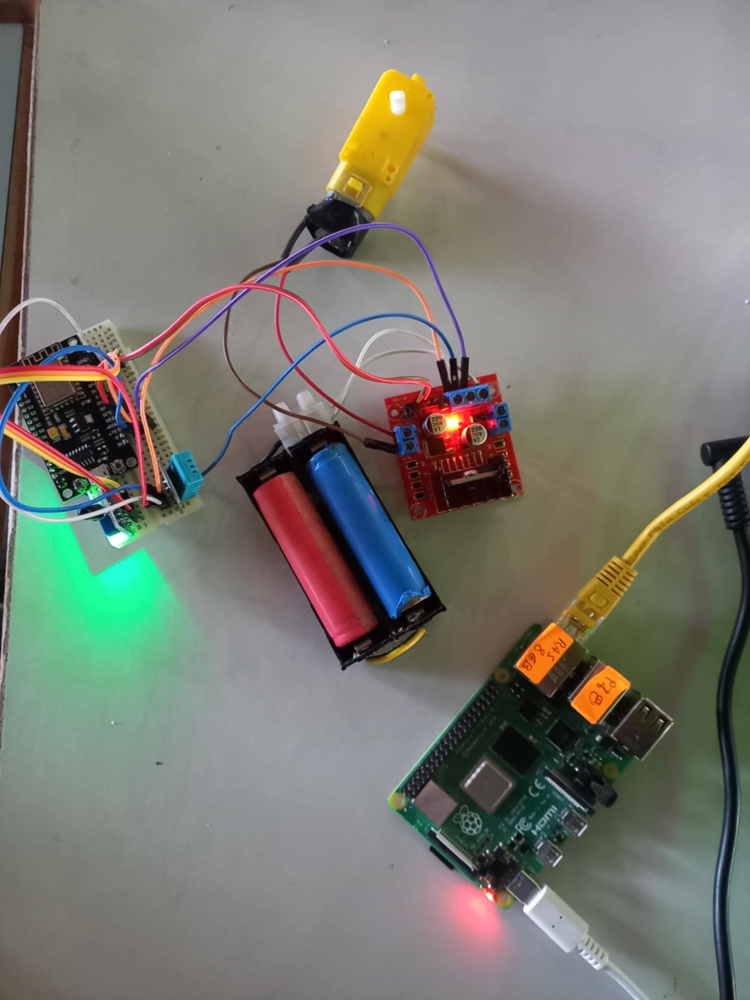
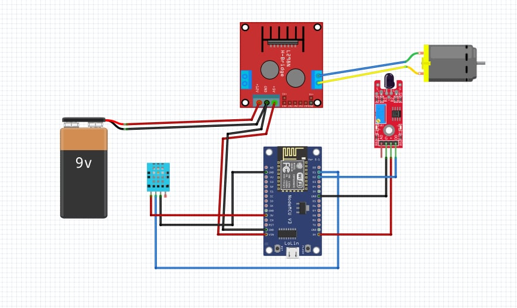
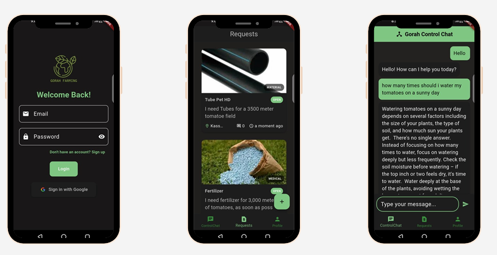
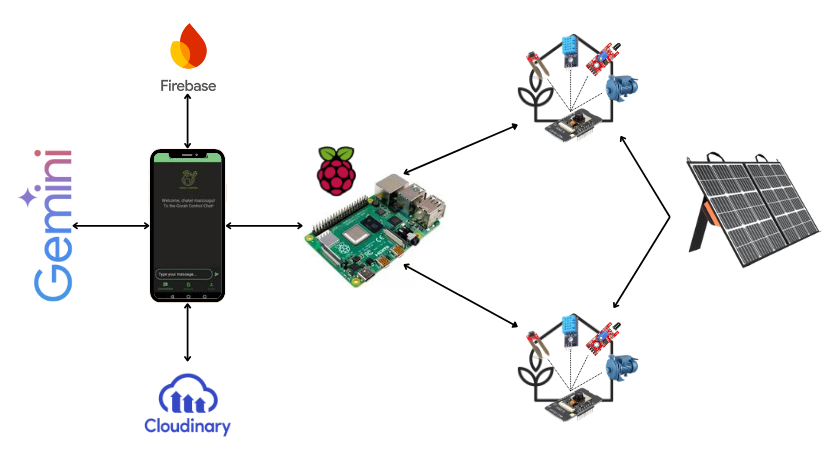

<div align="center">

[![Contributors][contributors-shield]][contributors-url]
[![Forks][forks-shield]][forks-url]
[![Stargazers][stars-shield]][stars-url]
[![Issues][issues-shield]][issues-url]
[![MIT License][license-shield]][license-url]
[![Chater][linkedin-shield]](https://www.linkedin.com/in/chater-marzougui-342125299/)
[![Habib][linkedin-shield]](https://www.linkedin.com/in/habib-bekir-35ab7b16b/)
[![Youssef][linkedin-shield]](https://www.linkedin.com/in/chaari-youssef-9ba4362bb/)
[![Yassine][linkedin-shield]](https://www.linkedin.com/in/yassine-ghorbel-33a692299/)
</div>

<!-- PROJECT LOGO -->
<br />
<div align="center">
  <a href="https://github.com/SfaynGH/Pillars-of-theFuture">
    
  </a>
    <h1 width="35px"> Gorah Farming 🌾
    </h1>
  <p align="center">
      Helping Farmers, The pillars of humanity
    <br />
    <br />
    <a href="https://github.com/SfaynGH/Pillars-of-theFuture/issues/new?labels=bug&template=bug-report---.md">Report Bug</a>
    ·
    <a href="https://github.com/SfaynGH/Pillars-of-theFuture/issues/new?labels=enhancement&template=feature-request---.md">Request Feature</a>
  </p>
</div>

## 📖 Overview
Gorah Farming is a comprehensive smart agriculture solution designed for greenhouse management, integrating IoT devices, AI-powered decision-making, and a user-friendly mobile application built with **Flutter**. The system automates irrigation, monitors plant health, and supports greenhouse owners with real-time data and AI-driven insights, all while promoting sustainability through solar energy.

The application includes:
- **Automated Irrigation Control** based on real-time sensor data.
- **Plant Disease Detection** using AI models.
- **AI-Powered Chatbot** for farming tips, greenhouse control, and scheduling (powered by Gemini).
- **Trading Platform** for fruits, fertilizers, and agricultural tools.
- **Fire Detection Alerts** to notify users in case of greenhouse fire risks.

All system operations are powered by solar panels, aligning with eco-friendly farming practices and the principles of Industry 5.0, which emphasize human-technology collaboration.

---

## 🖼️ Prototype Image
<div align="center">


  <br/>
  
</div>

---

## 📊 Prototype Conception
The system architecture includes:
- **ESP32** central node for a greenhouse.
- **Sensors** for temperature, humidity, soil moisture, and gas detection.
- **motor** simulating the smart valve
<div align="center">


  <br/>
  
</div>
---

## 📲 User Interface Screenshots
<div align="center">


  <br/>
  
</div>

---

## 🌐 General Architecture

<div align="center">


  <br/>
  
</div>
---

## ⚙️ How to Run the Project
1. **Clone the Repository:**
   ```bash
   git clone https://github.com/SfaynGH/Pillars-of-theFuture.git
   ```

2. **Set Up the Environment:**
   - Install dependencies for the Flutter app and ML models.
   - Configure Firebase and Cloudinary keys.

3. **Run the Flutter Mobile Application:**
   ```bash
   cd mobile-app
   flutter pub get
   flutter run
   ```

4. **Launch AI Models:**
   - Open the Jupyter notebooks inside `/models`.
   - Run each cell to load and test the plant disease detection and irrigation decision models.

5. **Connect IoT Devices:**
   - Configure ESP32 boards to send data to Firebase.
   - Ensure Raspberry Pi runs the local AI models and manages sensor data.


## Credits

Gorah Farming was created by Chater Marzougui, Habib Bekir, Yassine Ghorbel and Youssef Chaari.


## License

This project is licensed under the [MIT License](LICENSE).


[contributors-shield]: https://img.shields.io/github/contributors/SfaynGH/Pillars-of-theFuture.svg?style=for-the-badge
[contributors-url]: https://github.com/SfaynGH/Pillars-of-theFuture/graphs/contributors
[forks-shield]: https://img.shields.io/github/forks/SfaynGH/Pillars-of-theFuture.svg?style=for-the-badge
[forks-url]: https://github.com/SfaynGH/Pillars-of-theFuture/network/members
[stars-shield]: https://img.shields.io/github/stars/SfaynGH/Pillars-of-theFuture.svg?style=for-the-badge
[stars-url]: https://github.com/SfaynGH/Pillars-of-theFuture/stargazers
[issues-shield]: https://img.shields.io/github/issues/SfaynGH/Pillars-of-theFuture.svg?style=for-the-badge
[issues-url]: https://github.com/SfaynGH/Pillars-of-theFuture/issues
[license-shield]: https://img.shields.io/github/license/SfaynGH/Pillars-of-theFuture.svg?style=for-the-badge
[license-url]: https://github.com/SfaynGH/Pillars-of-theFuture/blob/master/LICENSE.txt
[linkedin-shield]: https://img.shields.io/badge/-LinkedIn-black.svg?style=for-the-badge&logo=linkedin&colorB=555
[linkedin-chater]: https://linkedin.com/in/chater-marzougui-342125299
[linkedin-habib]: https://www.linkedin.com/in/habib-bekir-35ab7b16b/
[linkedin-chaari]: https://www.linkedin.com/in/chaari-youssef-9ba4362bb/
[linkedin-yassine]: https://www.linkedin.com/in/yassine-ghorbel-33a692299/


